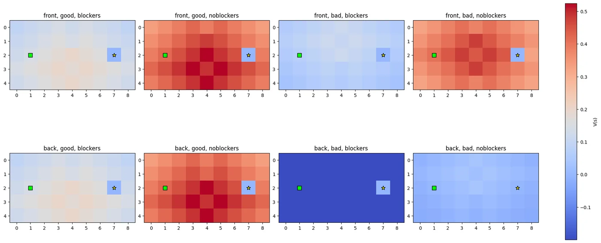
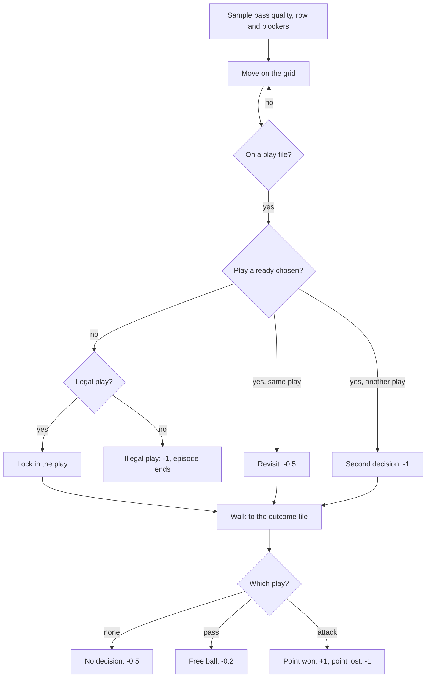
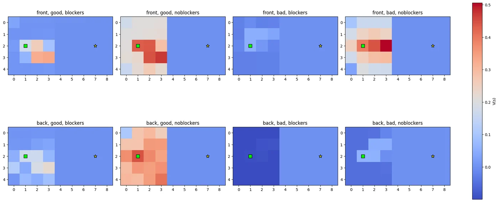
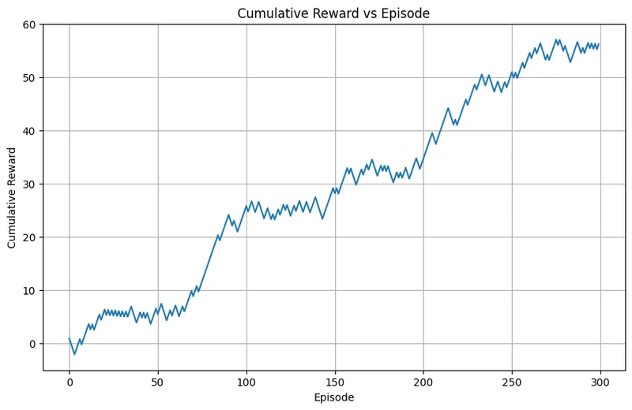

<div align="center">

# Volleyball Setter RL

A volleyball setter's decision framed as a reinforcement learning problem and solved four ways:<br>
dynamic programming, Monte Carlo, SARSA and Q-learning, each with a live Tkinter visualiser.

[![Python][badge-python]][link-python]
[![NumPy][badge-numpy]][link-numpy]
[![Matplotlib][badge-matplotlib]][link-matplotlib]
[![Tkinter][badge-tkinter]][link-tkinter]
[![Jupyter][badge-jupyter]][link-jupyter]
[![License: MIT][badge-license]](LICENSE)



<sub>State values from value iteration for the eight situations a setter can face.</sub>

</div>

## About

A volleyball setter's job is a neat decision problem. Every time the ball comes over, the setter has to choose a set based on how good the pass was, whether they are in the front or back row, and whether the other team has blockers up. Some sets are not even legal in some situations (a setter in the back row cannot dump the ball over), and every option has a different chance of winning the point.

This project turns that decision into a Markov decision process and compares the classic reinforcement learning algorithms on it: value iteration with the full model, Monte Carlo prediction and control, SARSA, and Q-learning. Each notebook comes with a Tkinter app that trains the agent, animates the learned policy, and plots rewards and state values.

## The decision

The situation is drawn at random at the start of every episode from three conditions:

| Condition | Values |
|---|---|
| Pass quality | good, bad |
| Setter position | front row, back row |
| Opposing blockers | up, not up |

The setter chooses one of five plays:

| Play | Legal when |
|---|---|
| Pass (send a free ball over) | always |
| Emergency set | bad pass |
| Dump (setter attacks on the second touch) | front row only |
| Quick set | good pass |
| High set | good pass |

Each attacking play wins the point with a probability that depends on the situation (from 0.25 for an emergency set from the back row into a block, up to 0.85 for a quick or high set off a good pass with no blockers). These probabilities are set by hand from how the game is played and live in `success_probability()` in each notebook.

## How it is modelled

The decision is laid out as a 5 x 9 grid that the agent walks across, which lets the same environment serve every algorithm and makes the policy easy to watch:

- the agent starts on the left, moves up, down, left or right, and must step onto one of five play tiles in the middle column, then reach the outcome tile on the right;
- the state is the grid position, the three conditions and the play already chosen (if any);
- the episode ends at the outcome tile or after an illegal play, and training episodes are capped at 200 steps.



Every move also costs 0.01 (0.005 in the Q-learning notebook), so shorter paths are slightly better. For dynamic programming the outcome of an attacking play enters as its expected value, 2p - 1; the sampling-based methods draw a win or a loss with probability p.

## Algorithms

| Notebook | Method | Settings |
|---|---|---|
| `volleyball/dp_volleyball.ipynb` | Value iteration using the known transition model | gamma 0.95, stopping threshold 1e-6 |
| `volleyball/mc_volleyball.ipynb` | First-visit and every-visit Monte Carlo, for prediction (random policy with exploring starts) and for control | gamma 0.95 |
| `volleyball/sarsa_volleyball.ipynb` | SARSA prediction and on-policy control | alpha 0.2, gamma 0.95, epsilon decaying from 0.3 to 0.05 |
| `volleyball/qlearning_volleyball.ipynb` | Q-learning, off-policy control | alpha 0.2, gamma 0.95, epsilon decaying linearly from 0.4 to 0.05 over 40,000 episodes |

Each app learns or solves the policy, runs it for a chosen number of test episodes, animates the agent on the grid under random conditions (Run Demo), and draws the reward per episode, the cumulative reward and the state-value heatmaps (Compute Graphs), with a speed slider for the animation.

## Results

The best play in each situation follows from the expected value of each legal option, with passing worth -0.2:

| Pass | Row | Blockers | Best play | Expected value |
|---|---|---|---|---|
| bad | back | up | pass | -0.2 (emergency set: -0.5) |
| bad | back | not up | emergency set | +0.1 |
| bad | front | up | emergency set | +0.2 |
| bad | front | not up | dump | +0.6 |
| good | back | up | quick or high set | +0.3 |
| good | front | up | quick or high set | +0.3 |
| good | back | not up | quick or high set | +0.7 |
| good | front | not up | quick or high set | +0.7 (dump: +0.6) |

These are the policies written down in `volleyball/optimal_policies.txt`, and value iteration recovers them exactly because it plans with the model. The heatmaps show the state values per situation. Value iteration (top of this page) fills in every cell; Q-learning only learns values for states its episodes actually visit, which is why the right half of its maps stays flat, but it agrees on which situations favour the attack.

<p align="center">
  
</p>

When the trained Q-learning policy is run greedily for 300 episodes with random situations, the cumulative reward climbs steadily to about +56:

<p align="center">
  
</p>

Every notebook saves the same three plots for its method in `volleyball/results/`.

## Project history

`first-version/` holds the first environment, built for an earlier assignment in August 2025, with its original commits: it already had the grid, the three conditions and the legality check in a single agent with a Tkinter app, and its history shows the conditions being added to the decision and then a penalty for touching a second play. The final version in `volleyball/` separates the environment from the learning algorithms, with one notebook per method. `practice/` has the warm-up exercises: a GridWorld agent and a Monte Carlo random-policy generator written both with and without helper libraries.

## Running it

```bash
pip install -r requirements.txt
jupyter lab
```

Open any notebook in `volleyball/` and run it top to bottom; the last cell starts the Tkinter app. Tkinter needs a desktop session, so the apps run locally, not in Colab or on a headless server.

## Repository layout

```
.
├── volleyball/
│   ├── dp_volleyball.ipynb          Value iteration
│   ├── mc_volleyball.ipynb          Monte Carlo prediction and control
│   ├── sarsa_volleyball.ipynb       SARSA prediction and control
│   ├── qlearning_volleyball.ipynb   Q-learning
│   ├── optimal_policies.txt         Expected best play for each situation
│   ├── decisionflow.png             Episode logic diagram
│   └── results/                     Reward curves and value heatmaps per method
├── first-version/                   The first environment, with its original history
├── practice/                        GridWorld and Monte Carlo warm-ups
└── docs/images/                     Figures used in this README
```

## Limitations

- The win probabilities are set by hand, so the agents rediscover what the probabilities encode rather than learning anything new about volleyball. Estimating them from match statistics would make the policies worth comparing with real coaching.
- One decision per episode keeps the problem small enough for tabular methods. A full rally, with the opponent's response and the next touch, would need function approximation.
- The grid walk adds steps that are not part of the real decision; it exists so that one environment works for every algorithm and the learned behaviour can be animated.

## License

Released under the [MIT License](LICENSE).

## Author

Made by Rudra Somaiya.

[![GitHub][badge-github]][link-github]
[![LinkedIn][badge-linkedin]][link-linkedin]

[badge-python]: https://img.shields.io/badge/Python-3776AB?style=for-the-badge&logo=python&logoColor=white
[badge-numpy]: https://img.shields.io/badge/NumPy-013243?style=for-the-badge&logo=numpy&logoColor=white
[badge-matplotlib]: https://img.shields.io/badge/Matplotlib-11557C?style=for-the-badge
[badge-tkinter]: https://img.shields.io/badge/Tkinter-GUI-3776AB?style=for-the-badge
[badge-jupyter]: https://img.shields.io/badge/Jupyter-F37626?style=for-the-badge&logo=jupyter&logoColor=white
[badge-license]: https://img.shields.io/badge/License-MIT-F7DF1E?style=for-the-badge
[badge-github]: https://img.shields.io/badge/GitHub-RudraSomaiya-181717?style=for-the-badge&logo=github&logoColor=white
[badge-linkedin]: https://img.shields.io/badge/LinkedIn-Rudra_Somaiya-0A66C2?style=for-the-badge&logo=data:image/svg%2bxml;base64,PHN2ZyB4bWxucz0iaHR0cDovL3d3dy53My5vcmcvMjAwMC9zdmciIHZpZXdCb3g9IjAgMCAyNCAyNCI+PHBhdGggZmlsbD0iI2ZmZiIgZD0iTTIwLjQ1IDIwLjQ1aC0zLjU2di01LjU3YzAtMS4zMy0uMDItMy4wNC0xLjg1LTMuMDQtMS44NSAwLTIuMTQgMS40NS0yLjE0IDIuOTR2NS42N0g5LjM1VjloMy40MXYxLjU2aC4wNWMuNDgtLjkgMS42NC0xLjg1IDMuMzctMS44NSAzLjYgMCA0LjI3IDIuMzcgNC4yNyA1LjQ2djYuMjh6TTUuMzQgNy40M2EyLjA2IDIuMDYgMCAxIDEgMC00LjEyIDIuMDYgMi4wNiAwIDAgMSAwIDQuMTJ6TTcuMTIgMjAuNDVIMy41NlY5aDMuNTZ2MTEuNDV6TTIyLjIyIDBIMS43N0MuNzkgMCAwIC43NyAwIDEuNzN2MjAuNTRDMCAyMy4yMy43OSAyNCAxLjc3IDI0aDIwLjQ1Yy45OCAwIDEuNzgtLjc3IDEuNzgtMS43M1YxLjczQzI0IC43NyAyMy4yIDAgMjIuMjIgMHoiLz48L3N2Zz4=
[link-python]: https://www.python.org
[link-numpy]: https://numpy.org
[link-matplotlib]: https://matplotlib.org
[link-tkinter]: https://docs.python.org/3/library/tkinter.html
[link-jupyter]: https://jupyter.org
[link-github]: https://github.com/RudraSomaiya
[link-linkedin]: https://www.linkedin.com/in/rudra-somaiya/
